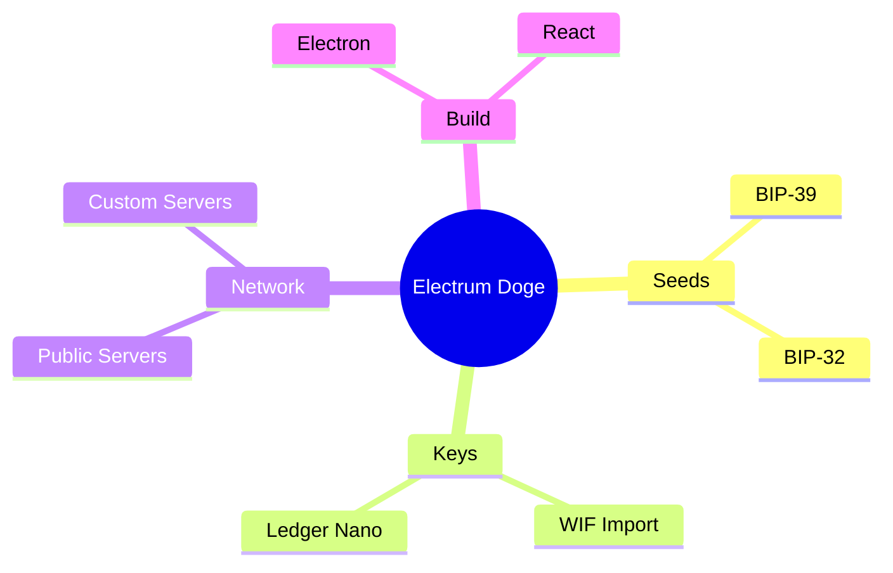
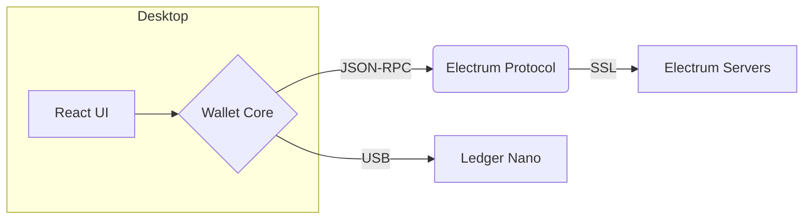

[](https://github.com/brdev-c/Electrum-Doge/releases)
[](LICENSE)

> Lightweight Dogecoin wallet built on Electrum. Fast ⸱ Secure ⸱ Open‑source.

---

## Feature Map



---

## Architecture



---

## Get Started (dev)

```bash
npm install && npm run start   # http://localhost:3000
```

Build desktop app:

```bash
npm run electron:build         # ➜ dist/
```

Full setup docs → `docs/DEV.md`

---

## Downloads

Grab pre‑built binaries for Windows, macOS, and Linux on the
[Releases page](https://github.com/brdev-c/Electrum-Doge/releases).

---

## Security

Your 12‑word seed **is** your wallet. Store it offline and verify signatures before installing.

---

## License

MIT – see [LICENSE](LICENSE).
