<p align="center">
  
</p>

<p align="center">
  <a href="https://github.com/brdev-c/Electrum-Doge/releases/latest">
    
  </a>
  <a href="LICENSE">
    
  </a>
</p>

<p align="center"><b>Lightweight Dogecoin wallet built on Electrum • Fast ⸱ Secure ⸱ Open‑source</b></p>

---

### Feature Map

```mermaid
mindmap
  root((Electrum Doge))
    🌱 Seeds
      "BIP‑39 mnemonics"
      "BIP‑32 HD tree"
    🔑 Keys
      "WIF Import"
      "Ledger Nano"
      "Trezor"
      "Watch‑Only Mode"
    🌐 Network
      "Public Servers"
      "Custom Servers"
      "Tor Proxy"
      "SSL Pinned"
    ⚙️ Wallet Core
      "Multi‑sig"
      "Dynamic Fees"
      "RBF / CPFP"
    🛠️ Build & CI
      "Electron"
      "React"
      "Cross‑platform CI"
```



---

### Architecture

```mermaid
flowchart LR
    subgraph Desktop
        A[React UI] --> B{Wallet Core}
    end
    B -->|JSON‑RPC| C(Electrum Protocol)
    C -->|SSL| D[Electrum Servers]
    B -->|USB| E[Ledger Nano]
    B -->|USB| F[Trezor]
```



---

### Get Started (dev)

```bash
git clone https://github.com/brdev-c/Electrum-Doge.git
cd Electrum-Doge
npm install
npm run start        # http://localhost:3000
```

Build desktop app:

```bash
npm run electron:build   # ➜ dist/
```

Full setup docs → [`docs/DEV.md`](docs/DEV.md)

---

### Downloads

<p align="center">
  <a href="https://github.com/brdev-c/Electrum-Doge/releases/latest/download/ElectrumDoge-Setup.exe">
    
  </a>
  <a href="https://github.com/brdev-c/Electrum-Doge/releases/latest/download/ElectrumDoge.dmg">
    
  </a>
  <a href="https://github.com/brdev-c/Electrum-Doge/releases/latest/download/electrum-doge.AppImage">
    
  </a>
</p>

Signatures and checksums are provided on the [Releases](https://github.com/brdev-c/Electrum-Doge/releases) page.

---

### Security

Your 12‑word seed **is** your wallet. Back it up offline and verify signatures before installing any release.

---

### License

[MIT](LICENSE)
